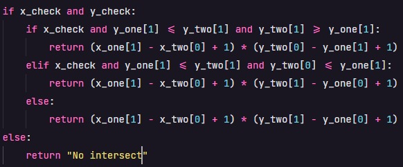
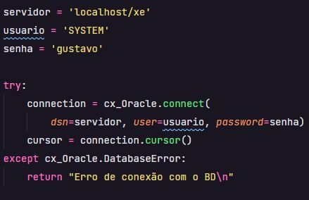
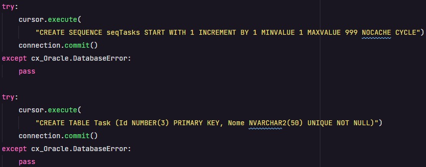
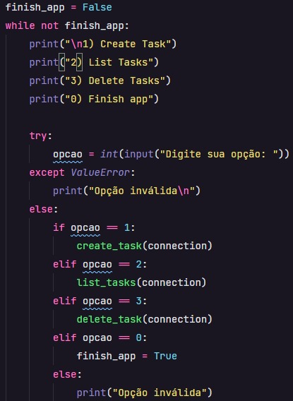
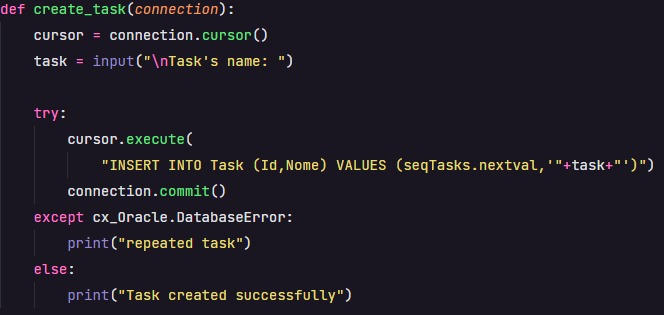
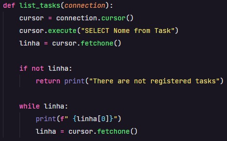
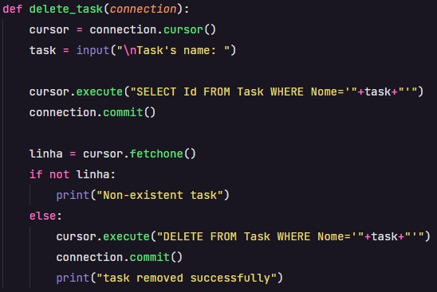
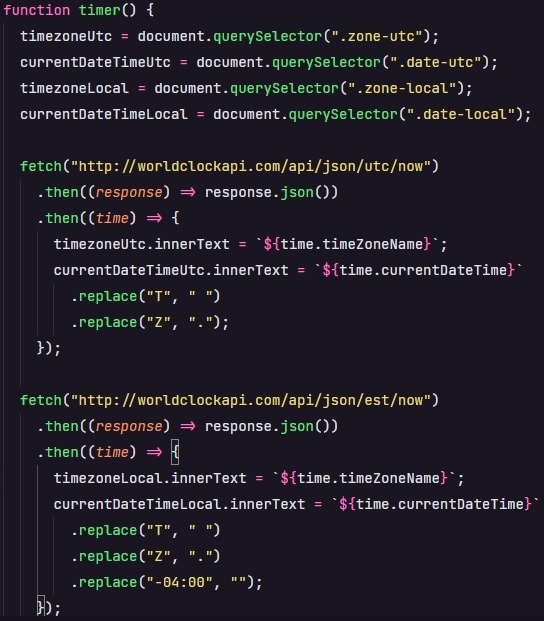
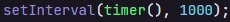
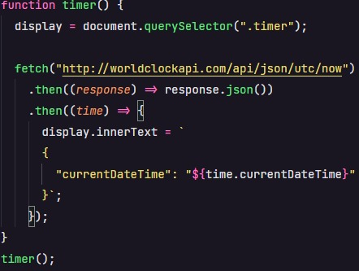

# Kaffa-Mobile---Pre-qualification-test

<ul>
  <li><h2>Exercise 1</h2></li>
  
I built my app using python. The app is about CNPJ validation.

  <ul>
    <li>
In this part, i clean the input string
</li>
    
    <li>
In this part, i calculate de check digits
</li>
    
    <li>
Finally, I compare the string check digits with the real check digits
</li>
    
  </ul>
  <h3>Remembering that to initialize the code is with the command: "python exercise_1.py"</h3>
  <li><h2>Exercise 2</h2></li>
  
I built my app using python. The app is about rectangles intersect.

  <ul>
    <li>
First i clean the input string and separate the coordinates (X,Y)
</li>
    
    <li>
After this, I validate the intersect of coordinates
</li>
    
    <li>
Finally, I return True for intersect and False for no intersect
</li>
    
  </ul>
  <h3>Remembering that to initialize the code is with the command: "python exercise_2.py"</h3>
  <li><h2>Exercise 3</h2></li>
  
I built my app using python. The app is about the intersect area of rectangles.

  <ul>
    <li><h4>The start is same of exercise 2</h4></li>
    <li>
In this part, i calculate the area depending of the how was the intersect
</li>
    
  </ul>
  <h3>Remembering that to initialize the code is with the command: "python exercise_3.py"</h3>
  <li><h2>Exercise 4</h2></li>
  
I built my app using python. The app is about a simple CRUD of tasks.

  <ul>
    <li>
To start, I use the oracle database, and in this part I made the connection to the database
</li>
    
    <li>
After this, I create the tables, or just pass them
</li>
    
    <li>
Thereby, in this part the user chooses the option he wants
</li>
    
    <li>
The option one is create task, she call the function "create_task"
</li>
    
    <li>
The option two is list task, she call the function "list_tasks"
</li>
    
    <li>
The option three is delete task, she call the function "delete_task"
</li>
    
  </ul>
  <h3>Remembering that to initialize the code is with the command: "python exercise_3.py", before this install the "instant client" and execute the comand = "pip install cx_oracle"</h3>
  <li><h2>Exercise 5</h2></li>
  
I built my app using HTML, CSS, JavaScript. The app is about consuming a world clock API.

  <ul>
    <li>
In this part, I select where I will put the information extracted from the API. After that, I extract the information and send it to the web page
</li>
    
    <li>
Thereby, i update for each 1 second
</li>
    
  </ul>
  <li><h2>Exercise 6</h2></li>
  
I built my app using HTML, CSS, JavaScript. The purpose of the application is to return in json format the "currentDateTime".

  <ul>
    <li>
First, I select where I will put the information extracted from the API. After that, I extract the "currentDateTime" and send it to web page.
</li>
    
  </ul>
  <h3>I didn't know how to make a "REST server", so I did it that way, I'm sorry</h3>
  <li><h2>Exercise 7</h2></li>
  
I built my app using draw.io. The exercise is about Entity Relationship Diagram with a model of a simple Order Manager System.

  <li><h2>Exercise 8</h2></li>
  
I built my app using figma. The exercise is about UX - Prototype and To create a project in order to design new elements in the electric network.

</ul>
