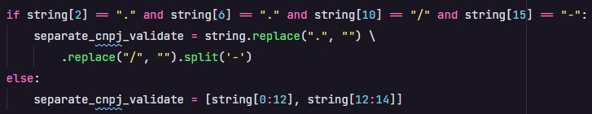
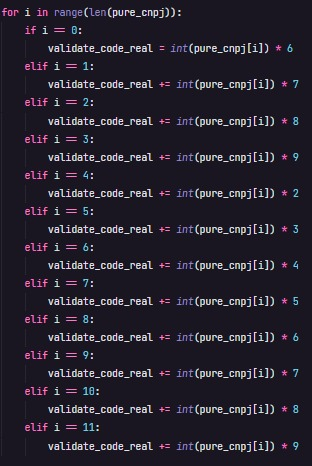
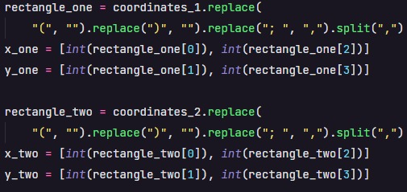
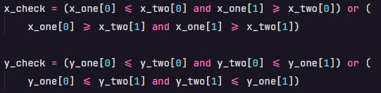
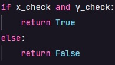

# Kaffa-Mobile---Pre-qualification-test

<ul>
  <li><h2>Exercise 1</h2></li>
  
I built my app using python. The app is about CNPJ validation.

  <ul>
    <li>
In this part, i clean the input string
</li>
    
    <li>
In this part, i calculate de check digits
</li>
    
    <li>
Finally, I compare the string check digits with the real check digits
</li>
    
  </ul>
  <h3>Remembering that to initialize the code is with the command: "python exercise_1.py"</h3>
  <li><h2>Exercise 2</h2></li>
  
I built my app using python. The app is about rectangles intersect.

  <ul>
    <li>
First i clean the input string and separate the coordinates (X,Y)
</li>
    
    <li>
After this, I validate the intersect of coordinates
</li>
    
    <li>
Finally, I return True for intersect and False for no intersect
</li>
    
  </ul>
  <h3>Remembering that to initialize the code is with the command: "python exercise_2.py"</h3>
  <li><h2>Exercise 3</h2></li>
</ul
